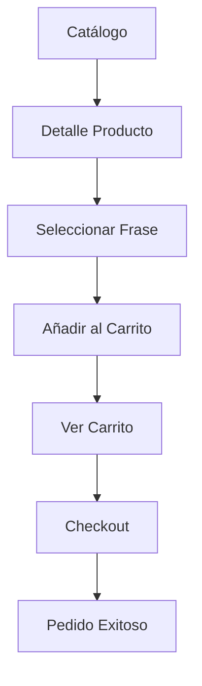

# DOCUMENTACIÓN DE VISTAS - 10TENDENCIAS

## 📋 ÍNDICE
1. [Estructura General](#estructura-general)
2. [Flujos de Trabajo](#flujos-de-trabajo)
3. [Patrones de Diseño](#patrones-de-diseño)
4. [Gestión de Sesiones](#gestión-de-sesiones)
5. [APIs AJAX](#apis-ajax)
6. [Manejo de Errores](#manejo-de-errores)
7. [Seguridad](#seguridad)

---

## 🏗️ ESTRUCTURA GENERAL

### Organización de Vistas

```
store/views.py
├── Vistas de Catálogo
│   ├── catalogo() - Página principal
│   └── producto_detalle() - Detalle de producto
├── Vistas de Carrito
│   ├── add_to_cart() - Añadir productos
│   ├── cart_detail() - Ver carrito
│   └── remove_from_cart() - Eliminar productos
├── Vistas de Checkout
│   ├── checkout_view() - Finalizar compra
│   └── pedido_exitoso() - Confirmación
└── APIs AJAX
    ├── get_provincias() - Provincias por país
    └── get_ciudades() - Ciudades por provincia
```

---

## 🔄 FLUJOS DE TRABAJO

### 1. Flujo de Compra Completo



### 2. Flujo de Gestión de Carrito

```
Usuario → Selecciona Producto → Elige Frase → Añade al Carrito
    ↓
Carrito en Sesión: {
    'producto_id-frase_id': {
        'producto_id': 1,
        'producto_nombre': 'Taza',
        'producto_precio': '15.00',
        'frase_id': 2,
        'frase_texto': '¡Tú puedes!',
        'cantidad': 1
    }
}
```

### 3. Flujo de Checkout

```
1. Validar carrito no vacío
2. Calcular totales
3. Mostrar formulario (GET)
4. Procesar formulario (POST)
5. Validar datos
6. Crear pedido (OrderService)
7. Limpiar carrito
8. Redirigir a éxito
```

---

## 🎨 PATRONES DE DISEÑO

### 1. Patrón MVC (Model-View-Controller)
- **Model**: `models.py` - Estructura de datos
- **View**: `views.py` - Lógica de presentación
- **Template**: `templates/` - Interfaz de usuario

### 2. Patrón Service Layer
```python
# Lógica compleja delegada a servicios
pedido = OrderService.create_order(form.cleaned_data, cart)
```

### 3. Patrón Repository (implícito)
```python
# Acceso a datos a través de modelos
productos = Producto.objects.all()
provincias = Provincia.objects.filter(pais_id=pais_id)
```

### 4. Patrón Factory (para formularios)
```python
# Creación de formularios según el contexto
form = CheckoutForm(request.POST) if request.method == 'POST' else CheckoutForm()
```

---

## 💾 GESTIÓN DE SESIONES

### Estructura del Carrito en Sesión

```python
request.session['cart'] = {
    '1-2': {  # producto_id-frase_id
        'producto_id': 1,
        'producto_nombre': 'Taza Personalizada',
        'producto_precio': '15.00',
        'producto_imagen': 'https://...',
        'frase_id': 2,
        'frase_texto': '¡Tú puedes!',
        'cantidad': 1
    },
    '3-1': {  # Otro item
        # ... datos del segundo item
    }
}
```

### Operaciones de Sesión

```python
# Obtener carrito
cart = request.session.get('cart', {})

# Añadir item
cart[item_id] = item_data
request.session['cart'] = cart

# Eliminar item
del cart[item_id]
request.session['cart'] = cart

# Limpiar carrito
del request.session['cart']
```

---

## 🌐 APIS AJAX

### 1. API de Provincias

**Endpoint**: `/catalogo/api/provincias/?pais_id=1`

**Respuesta**:
```json
[
    {"id": 1, "nombre": "Azuay"},
    {"id": 2, "nombre": "Bolívar"},
    {"id": 3, "nombre": "Cañar"}
]
```

### 2. API de Ciudades

**Endpoint**: `/catalogo/api/ciudades/?provincia_id=1`

**Respuesta**:
```json
[
    {"id": 1, "nombre": "Cuenca"},
    {"id": 2, "nombre": "Gualaceo"},
    {"id": 3, "nombre": "Paute"}
]
```

### Uso en Frontend

```javascript
// Cargar provincias cuando cambia el país
$('#id_pais').change(function() {
    var paisId = $(this).val();
    $.get('/catalogo/api/provincias/', {pais_id: paisId}, function(data) {
        // Actualizar select de provincias
    });
});
```

---

## ⚠️ MANEJO DE ERRORES

### 1. Objetos No Encontrados
```python
# En lugar de Producto.objects.get(pk=id)
producto = get_object_or_404(Producto, pk=producto_id)
```

### 2. Validación de Formularios
```python
if form.is_valid():
    # Procesar datos válidos
else:
    # Mostrar errores en el template
```

### 3. Manejo de Excepciones
```python
try:
    pedido = OrderService.create_order(form.cleaned_data, cart)
except Exception as e:
    print(f"Error al crear el pedido: {e}")
    # Manejar error apropiadamente
```

### 4. Validaciones de Negocio
```python
# Verificar carrito no vacío
if not cart:
    return redirect('catalogo')

# Verificar frase seleccionada
if not frase_id:
    return redirect('producto_detalle', producto_id=producto_id)
```

---

## 🔒 SEGURIDAD

### 1. Validación de Entrada
- **Django Forms**: Validación automática de tipos y formatos
- **Sanitización**: Django maneja automáticamente la sanitización
- **CSRF Protection**: Protección automática contra CSRF

### 2. Control de Acceso
```python
# Verificar existencia antes de acceder
pedido = get_object_or_404(Pedido, pk=pedido_id)

# Validar datos antes de procesar
if form.is_valid():
    # Solo procesar datos válidos
```

### 3. Protección de Sesiones
- **Session Security**: Django maneja la seguridad de sesiones
- **Session Cleanup**: Limpieza automática al completar pedido
- **Data Validation**: Validación de datos antes de guardar en sesión

### 4. URLs Seguras
```python
# URLs con parámetros validados
def producto_detalle(request, producto_id):
    producto = get_object_or_404(Producto, pk=producto_id)
```

---

## 📊 MÉTRICAS Y MONITOREO

### Logs Importantes
```python
# Log de errores en creación de pedidos
except Exception as e:
    print(f"Error al crear el pedido: {e}")

# Log de acciones del carrito
print(f"Producto {producto_id} añadido al carrito")
```

### Puntos de Control
1. **Carrito vacío**: Redirigir a catálogo
2. **Formulario inválido**: Mostrar errores
3. **Producto no encontrado**: 404 automático
4. **Error en creación de pedido**: Log y manejo de excepción

---

## 🚀 OPTIMIZACIONES FUTURAS

### 1. Caché
```python
# Cachear productos del catálogo
from django.core.cache import cache

def catalogo(request):
    productos = cache.get('productos_catalogo')
    if not productos:
        productos = Producto.objects.all()
        cache.set('productos_catalogo', productos, 3600)  # 1 hora
    return render(request, 'store/catalogo.html', {'productos': productos})
```

### 2. Paginación
```python
from django.core.paginator import Paginator

def catalogo(request):
    productos_list = Producto.objects.all()
    paginator = Paginator(productos_list, 12)  # 12 productos por página
    page = request.GET.get('page')
    productos = paginator.get_page(page)
    return render(request, 'store/catalogo.html', {'productos': productos})
```

### 3. Búsqueda
```python
from django.db.models import Q

def catalogo(request):
    query = request.GET.get('q')
    if query:
        productos = Producto.objects.filter(
            Q(nombre__icontains=query) | Q(descripcion__icontains=query)
        )
    else:
        productos = Producto.objects.all()
    return render(request, 'store/catalogo.html', {'productos': productos})
```

---

## 📝 NOTAS DE DESARROLLO

### Convenciones de Nomenclatura
- **Vistas**: `snake_case` (ej: `producto_detalle`)
- **URLs**: `kebab-case` (ej: `producto-detalle`)
- **Templates**: `snake_case.html` (ej: `producto_detalle.html`)

### Estructura de Contexto
```python
# Contexto mínimo y necesario
contexto = {
    'producto': producto,
    'frases': frases
}
```

### Comentarios en Código
```python
# Comentarios explicativos para lógica compleja
# TODO: Implementar caché para mejorar rendimiento
# FIXME: Manejar caso de carrito vacío
```

---

*Documentación generada para el proyecto 10tendencias - Django E-commerce* 